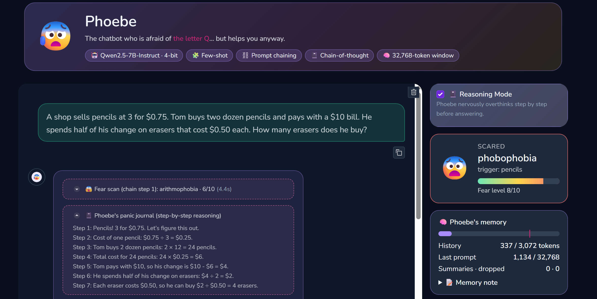

# 😰 Phoebe: the chatbot who is afraid of *everything* (but helps you anyway)

**EECE 503P/798S: Agentic Systems · Assignment C2: Build a Persona-Driven Chat App with an Open-Source LLM**
**Author:** Marwa Deeb (ID 202674575) · **Deliverable:** [`Deeb_LLM_Chatbot.ipynb`](Deeb_LLM_Chatbot.ipynb)

[](https://colab.research.google.com/github/marwadeeb/phoebe_chatbot/blob/main/Deeb_LLM_Chatbot.ipynb)

Phoebe is a web chat app powered by the open-source **Qwen2.5-7B-Instruct** model. Her twist: she is
scared of whatever you talk about (spiders, soup, numbers, Tuesdays...), reacts with a short burst of
cartoonish panic, and then **pushes through her fear to give you a correct, genuinely useful answer**.
A live *fear meter* shows how scared she is, and an optional **Reasoning Mode** shows her nervous
step-by-step "overthinking" in a separate panel before her final answer.



## TL;DR

- **What:** a Gradio chat app on **Qwen2.5-7B-Instruct** (open source, 4-bit, runs on Colab's free T4 GPU). Everything is in **[`Deeb_LLM_Chatbot.ipynb`](Deeb_LLM_Chatbot.ipynb)**.
- **Run it:** open the notebook in Colab → **Runtime → Change runtime type → T4 GPU** → **Runtime → Run all** → click the `gradio.live` link printed at the bottom (~10 min on the first run).
- **Persona:** Phoebe panics about every topic ("arachnophobia, 9/10!") but always gives a correct, useful answer. This is enforced by a system prompt plus few-shot examples.
- **Prompting techniques:** **few-shot** (voice and format), **prompt chaining** (a "fear scan" call returns JSON that drives the answer and the fear meter), and **chain-of-thought** (Reasoning Mode).
- **Context:** the model's window is **32,768 tokens**. History is capped at 3,072 tokens: past 75%, old turns are **summarized** into a memory note; past 100%, the oldest are **dropped**.
- **Bonus, Reasoning Mode:** a toggle that shows the reasoning in a separate panel. In the saved demos it turned **3 wrong answers into correct ones** (e.g. 23 × 47 − 18 × 19: 505 ❌ → 739 ✅).

---

## Contents
1. [How the assignment requirements are covered](#1-how-the-assignment-requirements-are-covered)
2. [Setup and run: Google Colab (recommended)](#2-setup-and-run-google-colab-recommended)
3. [Setup and run: on your own computer (optional)](#3-setup-and-run-on-your-own-computer-optional)
4. [How to use the app](#4-how-to-use-the-app)
5. [LLM choice and model details](#5-llm-choice-and-model-details)
6. [The persona twist and how it is implemented](#6-the-persona-twist-and-how-it-is-implemented)
7. [Prompting techniques used, and why](#7-prompting-techniques-used-and-why)
8. [How the system and user prompts are crafted](#8-how-the-system-and-user-prompts-are-crafted)
9. [Context handling: window size and what happens near the limit](#9-context-handling-window-size-and-what-happens-near-the-limit)
10. [Bonus: Reasoning Mode toggle](#10-bonus-reasoning-mode-toggle)
11. [Usage examples](#11-usage-examples)
12. [Project structure](#12-project-structure)
13. [Troubleshooting](#13-troubleshooting)
14. [Limitations](#14-limitations)

---

## 1. How the assignment requirements are covered

| Requirement (from the assignment) | Where / how | README section |
|---|---|---|
| Select and deploy an open-source transformer model | Qwen2.5-7B-Instruct (Apache-2.0), loaded with Hugging Face `transformers` | §5 |
| Host it locally or via an API | Hosted **locally on the GPU** of the Colab runtime (or your own PC); no external API | §2, §3, §5 |
| Minimal web UI to send messages and view replies | Gradio app (notebook §11–§12) | §4 |
| Clean, mobile-friendly layout, scrollable history, clear user/bot separation | Responsive two-column layout that stacks on phones; scrollable chat; green bubbles on the right for the user, purple bubbles with Phoebe's avatar on the left for the bot | §4 |
| Distinctive persona twist, implemented through a system prompt | Phoebe, afraid of everything; `PERSONA_SYSTEM_PROMPT` | §6 |
| At least two prompting techniques, stated with reasons | **Few-shot**, **prompt chaining**, **chain-of-thought** (and zero-shot for the summarizer) | §7 |
| Maintain chat history; truncate or summarize older turns | Token-budgeted memory: LLM **summarization**, then **dropping**, then **truncation** | §9 |
| State the context window size and what happens near the limit | **32,768 tokens**; step-by-step behavior explained, with a live memory gauge in the UI | §9 |
| Show how system and user prompts enforce the persona and trigger the techniques | Full prompt anatomy (system prompt + mode reminder appended to the user message), plus a *Prompt inspector* in both the notebook (§8) and the UI | §8 |
| README with setup, model details, usage examples | This file | §2, §3, §5, §11 |
| **Bonus:** Reasoning Mode toggle, CoT, reasoning shown separately, ≥2 before/after demos | Toggle in the UI; collapsible "📓 panic journal" panel; 4 auto-graded demo puzzles in notebook §10 (3 fixed by Reasoning Mode) | §10 |

---

## 2. Setup and run: Google Colab (recommended)

You need only a Google account; nothing is installed on your computer.

1. **Open the notebook in Colab.** Click the **Open in Colab** badge at the top of this page.
   *Alternative:* go to <https://colab.research.google.com>, choose **File → Upload notebook**, and select `Deeb_LLM_Chatbot.ipynb`.
2. **Turn on the GPU.** In the menu choose **Runtime → Change runtime type**, select **T4 GPU**, and click **Save**.
   (The notebook asks for a GPU automatically, but please check. Without a GPU the notebook stops with a clear message.)
3. **Run everything.** Choose **Runtime → Run all**. If Colab warns that the notebook was not authored by Google, click **Run anyway**.
4. **Wait for the model to download.** The first run downloads about 15 GB of model weights, which takes roughly 3–6 minutes. You can follow progress under each cell.
   A warning that `HF_TOKEN` is not set is harmless: the model is public and needs no account or token.
5. **Open the app.** The very last cell prints a line like `Running on public URL: https://xxxxxxxx.gradio.live`. Click it. The link works on your phone too and stays valid for 72 hours while the cell is running.
6. **Stop the app** with the ■ (stop) button next to the last cell, or with **Runtime → Disconnect and delete runtime**.
7. **Restart the app after stopping it:** run **only the last cell** again (click ▶ on it, not *Run all*; the model is still loaded). It prints a **new** `gradio.live` link. The old link stops working as soon as the app is stopped ("No interface is running right now"), so always open the newest one.

> Everything between loading and launching (the sanity check, the prompt inspector, the context-handling demo and the Reasoning Mode demos) runs automatically during **Run all**, so the saved outputs double as documentation.

---

## 3. Setup and run: on your own computer (optional)

You need an **NVIDIA GPU with at least 8 GB of memory** and an up-to-date NVIDIA driver. The app was
developed on Windows 11 with an RTX 5070 Laptop GPU (8 GB).

1. **Install Python 3.12 or newer** (tested with 3.14) from <https://www.python.org/downloads/>. On Windows, tick **"Add python.exe to PATH"** in the installer.
2. **Download this project.** Either click **Code → Download ZIP** on GitHub and unzip it, or run:
   ```bash
   git clone https://github.com/marwadeeb/phoebe_chatbot.git
   ```
3. **Open a terminal in the project folder** and create a virtual environment:
   ```bash
   python -m venv .venv
   ```
   Then activate it. On Windows (PowerShell): `.venv\Scripts\Activate.ps1`. On macOS/Linux: `source .venv/bin/activate`.
4. **Install PyTorch with CUDA.** RTX 50-series (Blackwell) GPUs need a CUDA 12.8+ build:
   ```bash
   pip install torch --index-url https://download.pytorch.org/whl/cu128
   ```
   (For older GPUs, <https://pytorch.org/get-started/locally/> gives you the right command.)
5. **Install the other dependencies:**
   ```bash
   pip install -r requirements.txt
   ```
6. **Start Jupyter and run the notebook:**
   ```bash
   jupyter notebook Deeb_LLM_Chatbot.ipynb
   ```
   Choose **Run → Run All Cells**. When the last cell prints `Running on local URL: http://127.0.0.1:7860`, open that address in your browser.

---

## 4. How to use the app

| Area | What it does |
|---|---|
| **Header** | A trembling Phoebe, and a tagline that cycles through her fears ("afraid of *spiders*... *soup*... *numbers*..."). |
| **Chat** (left) | Type in the box and press **Enter** or **Send 🫣**. Your messages appear in green bubbles on the right; Phoebe's appear in purple bubbles on the left, next to her avatar. Replies stream in word by word. The history scrolls, and each message has a copy button. |
| **Panels inside Phoebe's bubble** (dashed pink boxes) | **😱 Fear scan (chain step 1)** is collapsed and shows the JSON produced by the first model call; click to expand. **📓 Phoebe's panic journal** is the Reasoning Mode trace; it shows a spinner while she thinks and stays open afterwards. **🧠 Context manager** appears when old messages are summarized or dropped. |
| **📓 Reasoning Mode** (right) | Toggle it on to make Phoebe think step by step before answering (§10). |
| **Fear meter** (right) | Phobia name, trigger, and a 0–10 meter that updates on every message. It shakes at 7/10 or higher. |
| **🧠 Phoebe's memory** (right) | Live gauge of history tokens against the budget (the pink tick marks the 75% summarization threshold), the size of the last prompt against the 32,768-token window, counters for summaries and dropped messages, and the current memory note. |
| **🧪 Context lab** | A slider for the history budget. Set it to 512 to see summarization kick in after a few messages. |
| **🔬 Prompt inspector** | The exact prompt (system + few-shot + history + user) sent to the model for the last reply. |
| **🧹 Start over** | Clears the chat and Phoebe's memory. |
| **Examples** | One-click example prompts, including logic puzzles for trying Reasoning Mode. |

On a phone, the side panel moves below the chat, the bubbles widen to use the full screen width, and
the avatar is hidden to save space. All animations are turned off for users whose device is set to
*reduce motion*. Prices such as "$0.75" are shown as plain text; LaTeX rendering is disabled so
dollar signs are not mistaken for math.

---

## 5. LLM choice and model details

| | |
|---|---|
| **Model** | [`Qwen/Qwen2.5-7B-Instruct`](https://huggingface.co/Qwen/Qwen2.5-7B-Instruct) |
| **Type** | Decoder-only transformer, instruction-tuned chat model (7.6B parameters) |
| **License** | Apache-2.0 (open source; no sign-up or access request needed) |
| **Context window** | **32,768 tokens** (prompt + generated reply) |
| **How it is hosted** | Locally on the runtime's GPU, via Hugging Face `transformers` |
| **Quantization** | 4-bit NF4 with double quantization (`bitsandbytes`): ~15 GB of weights become **~5.5 GB of GPU memory** |
| **Precision** | float16 compute on a T4; bfloat16 on newer GPUs (chosen automatically) |
| **Tested on** | Google Colab T4, and locally on an RTX 5070 Laptop GPU (8 GB, Windows 11, PyTorch 2.11 + CUDA 12.8): the model loads in ~15–25 s from cache, the fear scan takes ~2–4 s, and answers stream immediately afterwards |
| **Decoding** | Chat: temperature 0.7, top-p 0.9. Reasoning Mode: temperature 0.3. Internal steps and demos: greedy (deterministic) |

**Why this model?**
- **It fits a free GPU.** In 4-bit it runs comfortably on Colab's free T4 (16 GB) and on an 8 GB laptop GPU.
- **It follows instructions well.** The app depends on the model reliably emitting JSON (fear scan) and `<worry>/<answer>` tags (Reasoning Mode). Qwen2.5 is among the strongest open 7B models at structured output.
- **It needs no gatekeeping.** Unlike Llama 3, it needs no Hugging Face token or license approval, so anyone can run the notebook immediately.
- **It is not a built-in "thinking" model.** Its step-by-step reasoning comes *only* from our chain-of-thought prompt, so the Reasoning Mode comparison really measures the effect of prompting.

---

## 6. The persona twist and how it is implemented

**Phoebe** (a pun on *phobia*) is sweet, knowledgeable, and afraid of almost everything. Every reply has three parts:

1. **Panic opener** (one sentence): she reacts to the scary thing and names the phobia, and her drama scales with the fear level.
2. **The real answer**: accurate, clear, complete.
3. **Nervous sign-off** (one line), e.g. *"Please lower them in with a spoon. For me. 🫣"*

It is implemented in four layers:

| Layer | Implementation |
|---|---|
| **System prompt** | `PERSONA_SYSTEM_PROMPT` defines the character, the three-part reply structure, and hard rules: *correctness beats comedy*, never refuse because of fear, at most two sentences of drama, never mock real anxiety disorders or the user. |
| **Few-shot examples** | Four example exchanges (boiling eggs, capital of Australia, a quick muffin-price puzzle, Python tips) demonstrate the voice and structure, including how a *quick* answer to a puzzle looks. |
| **Fear scan (prompt chain)** | Before each answer, a separate model call decides *what* scares Phoebe and *how much*. The answer prompt receives that JSON, so her panic is specific and proportional ("arachnophobia, 9/10" vs "ovophobia, 6/10"), and the UI's fear meter shows it. |
| **Gentle mode (responsible design)** | The fear scan also flags whether the *user* seems genuinely upset. If so, `GENTLE_MODE_INSTRUCTIONS` switch the comedy off for that reply: Phoebe answers warmly and, if there is any sign of danger, points to trusted people or crisis services. The joke never lands on someone who is struggling. |

The UI carries the persona too: the trembling avatar, the cycling list of fears, the fear meter, the
"panic journal" reasoning panel, and placeholder text such as *"Phoebe is hiding under a blanket. Say something... gently."*

---

## 7. Prompting techniques used, and why

| # | Technique | Where in the code | Why we used it | Where you can *see* it |
|---|---|---|---|---|
| 1 | **Few-shot prompting** | `FEW_SHOT_CHAT`, `FEW_SHOT_REASONING`, `FEW_SHOT_SCAN` | A persona described only in words drifts back to a generic assistant voice after a few turns. Showing 2–4 concrete examples locks in the tone, the three-part structure, the phobia-naming habit, and (for the scan) the exact JSON shape. It made the persona noticeably more consistent. | Prompt inspector (UI and notebook §8) |
| 2 | **Prompt chaining** | `fear_scan()` → `build_messages()` in `phoebe_reply_stream()` | Splitting "decide what is scary" from "write the answer" gives each call one simple job. Step 1 is deterministic and outputs structured data (trigger, phobia, fear level, distress flag). Step 2 uses it to scale Phoebe's panic, switch on gentle mode, and drive the UI's fear meter. A single prompt was less consistent about naming a phobia and had no machine-readable output for the UI. The context summarizer is a third chained call. | "😱 Fear scan (chain step 1)" panel under every message, and the fear meter |
| 3 | **Chain-of-thought** (bonus Reasoning Mode) | `REASONING_MODE_INSTRUCTIONS`, `REASONING_MODE_REMINDER`, `split_reasoning()` | Multi-step problems go wrong when the model answers immediately. Asking for numbered steps *before* the answer, including an explicit "double-check" step, improves correctness. Framed as Phoebe's anxious overthinking, it also fits the persona. | "📓 Phoebe's panic journal" panel, and demos in notebook §10 |
| 4 | **Zero-shot instruction** | `SUMMARIZER_PROMPT` | Summarizing old turns is a standard task the model does well without examples, so we kept that prompt short to save tokens. | Memory note in the "🧠 Phoebe's memory" panel |

---

## 8. How the system and user prompts are crafted

**Chain step 1: fear scan** (deterministic, max 80 new tokens)
```
[SYSTEM]    FEAR_SCAN_PROMPT: "reply with ONLY one JSON object with keys trigger, phobia, fear_level, user_distressed"
[USER]      "Latest user message: Can you explain how spiders make their webs?"           ┐
[ASSISTANT] {"trigger": "spiders", "phobia": "arachnophobia", "fear_level": 9, ...}       ├ few-shot (4 pairs)
...                                                                                        ┘
[USER]      "(Phoebe's previous reply, for context: ...)  Latest user message: <your message>"
```
The output is parsed with a regex plus `json.loads`, fields are validated and clamped (fear level 1–10), and a safe default (`phobophobia`, the fear of fear) is used if the JSON is malformed.

**Chain step 2: answer**
```
[SYSTEM]  PERSONA_SYSTEM_PROMPT                        ← who Phoebe is, reply structure, hard rules
          + MODE: QUICK ANSWER  |  MODE: REASONING      ← toggled by the UI (triggers chain-of-thought)
          + MEMORY NOTE: <summary of old turns>         ← only if older turns were summarized (§9)
          + FEAR SCAN: {"trigger": ..., "fear_level": 8, ...}  ← output of chain step 1
          + GENTLE MODE instructions                    ← only if user_distressed is true
[USER] / [ASSISTANT]  few-shot examples                 ← chat examples, or <worry>/<answer> examples in Reasoning Mode
[USER] / [ASSISTANT]  recent conversation history       ← Phoebe's final answers only
[USER]    <your message>                                ← truncated to 1,024 tokens if huge
          + mode reminder                               ← QUICK_MODE_REMINDER or REASONING_MODE_REMINDER
```

The two mode reminders appended to the user message:
```
Quick:     (Reply as Phoebe, with your panic opener and nervous sign-off. If this message is a puzzle, riddle,
            calculation or word problem, state only the final answer with at most one short sentence of
            justification: no steps, no lists, no working. Otherwise answer normally and in full.)
Reasoning: (Reasoning mode: first think step by step inside <worry>...</worry>, then give the final answer
            inside <answer>...</answer>.)
```

Design notes:
- All background context (persona, memory, fear scan) goes into the **single system message**, so the model treats it as instructions rather than something the user said.
- **The mode is restated in the user message.** At first the quick-answer rule was only in the system prompt, and Qwen ignored it: it wrote out its working anyway, so both modes looked the same. A short instruction at the end of the latest user message is followed much more reliably by a 7B model. It is added only to the prompt sent to the model; the chat history stores your original message.
- The few-shot set is **swapped with the mode**: in Reasoning Mode the examples show the `<worry>…</worry><answer>…</answer>` format, which is what makes the model follow it reliably.
- Everything is rendered with the model's own chat template (`tokenizer.apply_chat_template`), which also gives exact token counts.

The notebook's §8 prints a full example prompt, and the **🔬 Prompt inspector** in the UI shows the real prompt for every reply.

---

## 9. Context handling: window size and what happens near the limit

**Context window of the model: 32,768 tokens.** The prompt and the reply share it. The notebook prints
this value from the model's own config (`max_position_embeddings`).

The app does **not** fill the whole window. On a free GPU, long prompts use more memory and slow down
*every* reply, so chat history (memory note + past messages) gets a **history budget of 3,072 tokens**
(adjustable from 256 to 8,192 in the UI's *Context lab*). The persona prompt and few-shot examples
(~1,000–1,300 tokens) come on top, so a typical prompt stays under ~5,000 tokens.

Before every reply, `manage_context()` applies these rules in order:

| History size | What happens |
|---|---|
| **Below 75% of the budget** | All past messages are sent word-for-word. |
| **Above 75%** | **Summarization.** Everything except the last 2 exchanges is folded by the model (a chained, zero-shot call) into a structured **memory note** (a "User facts:" line plus up to 5 "topic: key answer" lines, under 90 words). The note goes into the system prompt. Phoebe still "remembers" early details at a fraction of the tokens. A "🧠 Context manager" panel appears in the chat, and the counters update. |
| **Still above 100%** (e.g. very long recent messages) | **Dropping.** The oldest messages are removed one at a time until history fits. The memory note is capped at half the budget. |
| **A single message over 1,024 tokens** | **Truncation.** The message is cut to 1,024 tokens, with a visible note. |
| **Hard safety net** | The reply length is capped at `32,768 − prompt tokens`, so prompt + reply can **never** exceed the window. |

Other details:
- Only Phoebe's **final answers** are stored. Reasoning traces and fear-scan JSON are shown in the UI but never re-sent, which keeps Reasoning Mode from eating the budget.
- Each browser session has its own memory (`gr.State`), so different users never see each other's history.
- **Demonstration:** notebook §9 runs a 5-turn conversation with a 400-token budget. The output shows summarization triggering, the token counts falling, and Phoebe still recalling the user's name and cat from turn 1 through the memory note.

---

## 10. Bonus: Reasoning Mode toggle

Turn on **📓 Reasoning Mode** in the side panel, and three things change:

1. **Step-by-step reasoning is elicited.** Three prompt parts change together:
   - the system prompt switches from *QUICK ANSWER* to *REASONING MODE*;
   - the few-shot examples switch to ones that show numbered steps inside `<worry>…</worry>`, ending with an explicit "double-check" step, followed by the reply inside `<answer>…</answer>`;
   - the reminder appended to your message switches to "think step by step first".

   Temperature also drops to 0.3 for steadier reasoning.

   With Reasoning Mode **off**, the reminder tells Phoebe to answer puzzles with *only* the final answer. So "off" really means "no chain-of-thought", and the two modes produce visibly different replies.
2. **Reasoning is separated from the answer.** `split_reasoning()` parses the tags *while the reply streams*. The reasoning goes into a collapsible **"📓 Phoebe's panic journal (step-by-step reasoning)"** panel, which shows a spinner while she is still thinking. The final answer appears below it as a normal chat bubble, the same way reasoning models display their thoughts. If the model ever skips the tags, the whole reply is shown as the answer, so nothing is lost.
3. **Only the final answer is kept in memory**, not the reasoning (see §9).

### Demonstration: Reasoning Mode off vs on

Notebook §10 runs 4 multi-step puzzles in both modes. It uses greedy decoding, so the results are
reproducible, and grades each final answer automatically (✅/❌).

**Results** (saved in the notebook outputs):

| # | Puzzle | Correct | Reasoning **OFF** | Reasoning **ON** |
|---|---|---|---|---|
| 1 | What is 23 × 47 − 18 × 19? | 739 | ❌ **505** | ✅ **739** |
| 2 | How many days from March 3 to May 17 (non-leap year, count May 17, not March 3)? | 75 | ❌ **65 days** | ✅ **75 days** |
| 3 | Chickens and cows: 30 heads, 74 legs. How many cows? | 7 | ❌ **12 cows** | ✅ **7 cows** |
| 4 | Pencils 3 for $0.75; buys 2 dozen with a $10 bill; half the change on $0.50 erasers. How many erasers? | 4 | ✅ **4** | ✅ **4** |

**Reasoning Mode turned 3 of the 4 answers from wrong to right.** For example:

> **Demo 1, OFF:** *"Multiplication tables?! I-I can't! 😱 (arithmophobia, 6/10) The answer is **505**. \*runs for the hills\*"* ❌
>
> **Demo 1, ON, 📓 panic journal:**
> *Step 2: Break down 23 × 47: 23 × 40 = 920, 23 × 7 = 161, 920 + 161 = 1081.*
> *Step 4: Break down 18 × 19: 18 × 20 = 360, 18 × 1 = 18, 360 - 18 = 342.*
> *Step 5: Subtract the results: 1081 - 342 = 739.*
> **Final answer:** *"The final answer is **739**: 23 × 47 = 1081, 18 × 19 = 342, and 1081 - 342 = 739."* ✅

> **Demo 3, OFF:** *"C-cows?! And \*numbers\*?! 😱 There are **12 cows**."* ❌
>
> **Demo 3, ON, 📓 panic journal:** *"Let x be the number of cows… x + y = 30 … 4x + 2y = 74 … 4x + 2(30 - x) = 74 → 2x = 14 → x = 7. Check: 7 cows + 23 chickens = 30, and 7\*4 + 23\*2 = 74."*
> **Final answer:** *"There are **7 cows**."* ✅

Demo 4 is a control case. The model gets this word problem right either way, because it still works
through the money step by step even in quick mode. Chain-of-thought helps most where the model would
otherwise *guess* a number, as with mental arithmetic, counting, or equations. It is not a guarantee:
an age riddle we tried was answered wrongly in both modes, so we left it out of the demo.

---

## 11. Usage examples

These are real transcripts from the saved notebook run (lightly shortened).

**Everyday question** (Reasoning Mode off)
> **You:** How do airplanes stay in the air?
> **😱 Fear scan:** `{"trigger": "airplanes", "phobia": "aviophobia", "fear_level": 6, "user_distressed": false}`
> **Phoebe:** Airplanes?! Flying machines... I-I can't believe I'm about to explain this! \*shudders\*
> Airplanes stay in the air due to **lift**, which is created by the shape of their wings (airfoils) and the speed of the plane. As air moves over the curved top surface of the wing, it has to travel faster than the flat bottom surface, creating lower pressure above and higher pressure below, which pushes the plane up. Plus, there's **thrust** from the engines pushing forward and **gravity** pulling down…
> \*deep breath\*

**Word problem** (Reasoning Mode off vs on): see the demos in §10.

**Memory across turns** (notebook §9, history budget shrunk to 400 tokens)
> **Turn 1, You:** Hi Phoebe! My name is Sam and I have a cat called Pickles.
> *Turns 2–4: a hiking snack, centipede legs, a sleep tip. Before turn 5, the history (340/400 tokens) is over 75% of the budget, so the 4 oldest messages are folded into the memory note ("User facts: Sam, has a cat named Pickles…"), and the history drops to 205 tokens.*
> **Turn 5, You:** Do you remember my name and my cat's name?
> **Phoebe:** Oh, hello there! I remember you mentioned your name is Sam and your cat's name is Pickles. \*gives a nervous smile\* 🐱😊

Turn 1 itself was no longer in the prompt at that point. Phoebe recalled the names from the memory note.

---

## 12. Project structure

```
phoebe_chatbot/
├── Deeb_LLM_Chatbot.ipynb        ← THE DELIVERABLE: the whole app in one Colab notebook
├── README.md                     ← this file
├── requirements.txt              ← dependencies for running locally
├── notebook_src/
│   └── Deeb_LLM_Chatbot.py       ← source of the notebook (plain Python, "# %%" cell markers)
└── tools/
    ├── build_notebook.py         ← rebuilds the .ipynb from the source file
    └── dev_ui.py                 ← runs the app locally (add --fake for canned replies, no GPU)
```

The notebook is developed as a plain Python file, which gives clean diffs and easy editing, and then
converted with `python tools/build_notebook.py`. The final committed notebook is re-run so that it
contains its outputs.

Notebook sections: §1 install · §2 config · §3 model loading and generation helpers · §4 prompts ·
§5 context manager · §6 prompt chain · §7 sanity check · §8 prompt inspector · §9 context demo ·
§10 Reasoning Mode demos · §11 UI · §12 launch.

---

## 13. Troubleshooting

| Problem | Fix |
|---|---|
| `AssertionError: No GPU found` | **Runtime → Change runtime type → T4 GPU**, then **Runtime → Run all** again. |
| Colab says no GPU is available | Free GPU quota is temporarily used up. Try again later, or use a different Google account. |
| `CUDA out of memory` | **Runtime → Restart session**, then run all again. Locally, close other GPU-heavy programs. |
| No `gradio.live` link appears | Scroll to the bottom of the last cell's output; it can take ~10 s. If share links are blocked on your network, run locally and use `http://127.0.0.1:7860`. |
| Replies are slow | Normal: the fear scan takes ~2–4 s, then the answer streams in. Reasoning Mode writes more text, so it takes longer. |
| Locally: `torch.cuda.is_available()` is `False` | You installed the CPU-only PyTorch. Reinstall with the CUDA command from §3, step 4. |

---

## 14. Limitations

- A 7B model can still make mistakes, including in Reasoning Mode. Chain-of-thought improves multi-step accuracy but does not guarantee it (see §10).
- On some word problems, Qwen2.5 still works through the steps in quick mode (demo 4 in §10). For those prompts, the off/on difference is small.
- In Reasoning Mode, Phoebe sometimes uses a different phobia name in her final answer than the one the fear scan picked (e.g. scan: *arithmophobia*, answer: *equinophobia*). The fear meter always shows the scan's value.
- The very first message after launch is slower (a few extra seconds) while the GPU warms up.
- Invented phobia names (e.g. "australophobia") are part of the joke and are not real medical terms.
- One GPU serves one reply at a time (a Gradio queue with concurrency 1), so simultaneous users wait their turn.
- The memory note is a lossy summary: fine details from very old turns may be lost once they are summarized.
